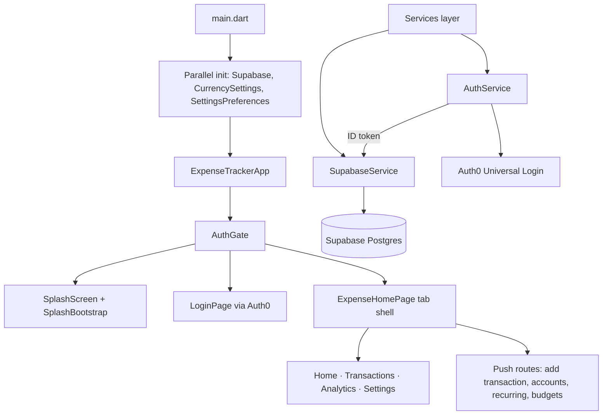

# Expense Tracker App — Architecture

## Overview

Flutter expense tracker with Auth0 login, Supabase persistence, and a component-based UI. The app is organized into thin screens, reusable components, singleton services, and pure utils — no global state-management framework; session-scoped data lives in `ChangeNotifier` / `ValueNotifier` singletons, and tab-level data is owned by `ExpenseHomePage`.

Visual conventions live in [DESIGN.md](./DESIGN.md). Database schema (mind map): [DATABASE_SCHEMA.md](./DATABASE_SCHEMA.md). Backend setup guides: [auth0_setup.md](./auth0_setup.md), [supabase_setup.md](./supabase_setup.md).

---

## High-level flow



---

## Bootstrap

`main.dart` initializes the app in parallel, then mounts `AuthGate`:

1. `SupabaseService.init()` — configures Auth0 token bridge and `Supabase.initialize`
2. `CurrencySettings.instance.load()` — local currency preference
3. `SettingsPreferences.instance.load()` — local user settings cache
4. `DeepLinkService.instance.start()` — widget / app-link intents (non-blocking)

On failure, `ErrorApp` is shown instead of the main app.

`ExpenseTrackerApp` wraps `MaterialApp` in a `ListenableBuilder` over global preference notifiers (`CurrencySettings`, `CategoryCatalog`, `SettingsPreferences`) so theme-adjacent rebuilds propagate when catalogs change.

Compile-time secrets come from `--dart-define` (see `config.dev.json.example` and `lib/utils/app_config.dart`):

| Define | Purpose |
| --- | --- |
| `SUPABASE_URL` | Supabase project URL |
| `SUPABASE_ANON_KEY` | Supabase anon key |
| `AUTH0_DOMAIN` | Auth0 tenant domain |
| `AUTH0_CLIENT_ID` | Auth0 native app client ID |
| `AUTH0_CALLBACK_SCHEME` | iOS custom-scheme callback (optional) |
| `AUTH0_USE_HTTPS` | Use HTTPS app links on iOS (optional) |

---

## Authentication

**Auth0** handles login; **Supabase** stores data. The two are linked by passing Auth0 ID tokens to Supabase via a custom `accessToken` callback in `SupabaseService.init()`.

| Piece | Location | Role |
| --- | --- | --- |
| `AuthService` | `services/auth_service.dart` | Auth0 SDK, credential storage, `AppSession` notifier |
| `AuthGate` | `components/common/auth_gate.dart` | Routes splash → login → app based on session |
| `SplashBootstrap` | `services/splash_bootstrap.dart` | Offline-first startup: restore session, sync prefs, pick destination |
| `LoginPage` | `screens/auth/login_page.dart` | Auth0 Universal Login entry |
| `SupabaseService.requireUserId()` | `services/supabase_service.dart` | Scopes every query to Auth0 `sub` |

On sign-in, `AuthGate` syncs user-scoped singletons (`CategoryCatalog`, `IncomeCategoryCatalog`, `CategoryBudgetService`, `CurrencySettings`, `SettingsPreferences`). On sign-out, each calls `onSignedOut()` to clear in-memory state.

---

## Navigation

There is no named router (`go_router` / routes table). Navigation uses two patterns:

### Tab shell (`ExpenseHomePage`)

Five bottom-nav tabs: **Home (0) · Transactions (1) · Analytics (2) · Budgets (3) · Settings (4)**, plus a centre FAB (not a tab index) that opens `AddTransactionPage`. Tab bodies swap via `AnimatedSwitcher`.

Tab content is composed inline:

| Index | Content | Primary file |
| --- | --- | --- |
| 0 | Dashboard | `components/home/home_content.dart` |
| 1 | Transaction list | `components/home/transactions_content.dart` |
| 2 | Analytics | `screens/analytics/analytics_page.dart` |
| 3 | Budgets | `screens/settings/sections/budgets_and_spending_page.dart` (`BudgetsAndSpendingContent` — filed under `settings/` despite being a primary tab, not a Settings subpage) |
| 4 | Settings hub | `screens/settings/settings_page.dart` |

### Push routes

Full-screen flows use `Navigator.push` from the home shell or settings:

- `screens/transaction/add_transaction_page.dart` — create / edit transactions
- `screens/accounts/` — list, detail, add/edit bank/credit/wallet accounts
- `screens/recurring/recurring_payments_page.dart` — subscriptions, EMIs, upcoming timeline
- `screens/settings/sections/` — settings sub-pages (categories, budgets, profile, etc.)

Sheets and dialogs (`showModalBottomSheet`, custom overlays) live under `components/dialogs/` and feature folders (e.g. `transaction_detail_sheet.dart`).

---

## Project structure

```
lib/
├── main.dart
├── config/
│   ├── design_tokens.dart          # Colors, spacing, typography tokens
│   ├── theme.dart                  # AppTheme.darkTheme (Material 3)
│   └── feature_flags.dart          # Compile-time UI toggles (see Feature flags)
├── models/                         # Domain types & Supabase row mappers
├── services/                       # Singletons: auth, sync, preferences
├── screens/                        # Full pages & navigation owners
├── components/                     # Reusable UI by feature area
└── utils/                          # Pure helpers, aggregations, validators

sql/                                # Supabase migrations (see DATABASE_SCHEMA.md)
docs/                               # Auth0 / Supabase setup guides
ios/AddExpenseWidget/              # iOS home-screen widget (deep link → add expense)
```

### `lib/models/`

| File | Purpose |
| --- | --- |
| `transaction.dart` | Primary money event (`expense` / `income` / `transfer`), recurrence fields |
| `transaction_draft.dart` | Mutable form state for add/edit flows |
| `transaction_filters.dart` | List filter model |
| `account.dart` | Bank, credit card, wallet accounts |
| `expense.dart` | Legacy expense adapter (still used by some helpers) |
| `expense_category.dart` / `income_category.dart` | User category rows |
| `category_budget.dart` | Per-category monthly budgets |
| `recurring_event.dart` | Standalone recurring events table |
| `user_settings.dart` | Remote user preferences row |
| `app_session.dart` | Auth0 session snapshot |

### `lib/services/`

| Service | Pattern | Purpose |
| --- | --- | --- |
| `SupabaseService` | Static methods | All Postgres CRUD |
| `AuthService` | Singleton + `ValueNotifier` | Auth0 session |
| `SplashBootstrap` | Singleton | Startup orchestration |
| `CategoryCatalog` | Singleton + `ChangeNotifier` | Expense categories (local + remote) |
| `IncomeCategoryCatalog` | Singleton + `ChangeNotifier` | Income categories |
| `CategoryBudgetService` | Singleton + `ChangeNotifier` | Category budgets |
| `CurrencySettings` | Singleton + `ChangeNotifier` | Display currency |
| `SettingsPreferences` | Singleton + `ChangeNotifier` | App preferences (timezone, etc.) |
| `TransactionListPreferences` | Singleton | Transactions tab sort/filter prefs |
| `DeepLinkService` | Singleton | App link listener |
| `AppLaunchIntentHolder` | Singleton + `ValueNotifier` | Parsed widget intents |

### `lib/screens/`

| Folder | Screens |
| --- | --- |
| `auth/` | `login_page.dart`, `splash_screen.dart` |
| `home/` | `expense_home_page.dart` — main tab shell & data owner |
| `transaction/` | `add_transaction_page.dart` |
| `accounts/` | List, detail, credit detail, add/edit |
| `analytics/` | `analytics_page.dart` |
| `recurring/` | `recurring_payments_page.dart` |
| `settings/` | Hub + `sections/` sub-pages |

### `lib/components/`

Feature-grouped reusable widgets. Screens compose these; they do not call Supabase directly (callbacks / data passed from parent).

| Folder | Responsibility |
| --- | --- |
| `common/` | `auth_gate`, `error_app`, `compact_header`, `states/` (empty/loading/error UX) |
| `home/` | Dashboard + transactions tab content |
| `home/dashboard/` | Hero card, recent transactions, quick actions, budget sheet |
| `transaction/` | Add form fields, list item, detail sheet + sections |
| `accounts/` | Account cards, forms, credit sections |
| `analytics/` | Analytics sections + chart widgets |
| `recurring/` | Subscription/EMI cards, timeline, add sheet |
| `settings/` | Settings rows, sections, subpage scaffold |
| `profile/` | Profile edit widgets |
| `auth/` | Login form |
| `dialogs/` | Shared modals and confirmation sheets |

### `lib/utils/`

Pure functions and small helpers — no Flutter widget trees except where UI-adjacent (e.g. `snackbar_helper.dart`).

| Area | Files |
| --- | --- |
| Config | `app_config.dart`, `constants.dart` |
| Validation | `validators.dart` |
| UX | `snackbar_helper.dart`, `category_style.dart` |
| Aggregations | `dashboard_aggregations.dart`, `analytics_aggregations.dart`, `financial_insights.dart` |
| Domain | `recurring_management.dart`, `upcoming_payments.dart`, `account_management.dart`, `transaction_filter_logic.dart`, `transaction_grouping.dart`, `transaction_subtype_helpers.dart`, `income_flow_helpers.dart`, `recurrence_normalization.dart` |
| Formatting | `transaction_date_format.dart`, `timezone_options.dart`, `profile_identity.dart` |

---

## Feature flags

`lib/config/feature_flags.dart` holds compile-time UI toggles — no remote config, just a static class flipped in source. Current flag:

| Flag | Default | Effect |
| --- | --- | --- |
| `FeatureFlags.transferVisible` | `false` | Hides `transfer` from the quick actions, type selector, and filters. Existing transfer transactions still display/edit normally; `normalizeKind()` downgrades new transfers to `expense`. |

Screens read flags directly (e.g. `expense_home_page.dart` guards the transfer quick action) rather than threading a config object through the widget tree. Add new flags as additional static `const bool` fields plus any derived helper methods, following the same pattern.

---

## Data layer

### Supabase tables

Migrations are dated SQL files in `sql/`, applied manually to Supabase. For the full mind-map view (relationships, enums, migration order), see [DATABASE_SCHEMA.md](./DATABASE_SCHEMA.md). Core tables:

| Table | Model | Notes |
| --- | --- | --- |
| `transactions` | `Transaction` | Unified expenses, income, transfers; recurrence on same row |
| `accounts` | `Account` | Bank, credit, wallet; opening balance + metadata |
| `expense_categories` | `ExpenseCategory` | User-defined with icon keys |
| `income_categories` | `IncomeCategory` | Same pattern for income |
| `category_budgets` | `CategoryBudget` | Monthly limits per category |
| `recurring_events` | `RecurringEvent` | Supplemental recurring metadata |
| `user_settings` | `UserSettings` | Remote preference blob |

Legacy `expenses` table SQL remains for reference; the app reads/writes `transactions`.

### `SupabaseService` surface

Grouped responsibilities:

- **Transactions** — `fetchTransactions`, `insertTransaction`, `updateTransaction`, `deleteTransaction`, pause/close recurring
- **Accounts** — CRUD + archive
- **Categories** — fetch, seed defaults, insert/delete (expense + income)
- **Budgets** — fetch, upsert, delete
- **Recurring events** — fetch, insert, delete
- **User settings** — fetch, upsert
- **Legacy** — `fetchExpenses` / `insertExpense` adapters for older call sites

All writes attach `user_id` from `AuthService.instance.currentSession`.

---

## State management

No Provider / Riverpod / Bloc. Current approach:

| Scope | Owner | Mechanism |
| --- | --- | --- |
| Auth session | `AuthService.session` | `ValueNotifier<AppSession?>` |
| Global prefs / catalogs | Service singletons | `ChangeNotifier` + `ListenableBuilder` in `main.dart` |
| Tab data (transactions, accounts) | `ExpenseHomePage` | `StatefulWidget` + `setState`, refreshed via `_loadTransactions` / `_refreshDashboard` |
| Feature sub-screens | Individual screens | Local state; mutate via `SupabaseService`, then callback to parent or pop |
| Forms | Page state / `TransactionDraft` | Passed into components as immutable snapshots + callbacks |

This keeps dependencies explicit. Trade-off: `ExpenseHomePage` is large and owns most synced list state; extracting a dedicated dashboard controller would be a natural next step.

---

## Deep links & iOS widget

`DeepLinkService` listens for app links and writes parsed intents to `AppLaunchIntentHolder`. `ExpenseHomePage` polls/consumes intents after load to open the add-expense flow (used by the iOS `AddExpenseWidget`).

---

## Layer rules

### Screens
- Own navigation and orchestration
- Fetch/mutate via `SupabaseService` (or delegate to a service singleton)
- Pass data + callbacks into components

### Components
- Single UI concern; stateless when possible
- No direct Supabase calls — receive `onSave`, `onDelete`, etc.
- Import design tokens, not hardcoded colors

### Services
- One backend or cross-cutting concern per file
- Singleton `.instance` for app-wide lifecycle
- `onSignedOut()` / `syncForUser()` hooks for auth transitions

### Utils
- Pure logic, formatting, aggregations
- Safe to unit test without widget binding

---

## Dependency sketch

```
main.dart
├── config/theme.dart
├── services/supabase_service.dart → auth_service.dart, models/*
├── services/currency_settings.dart
├── services/settings_preferences.dart
├── services/deep_link_service.dart
└── components/common/auth_gate.dart
    ├── services/splash_bootstrap.dart
    ├── screens/auth/splash_screen.dart
    ├── screens/auth/login_page.dart
    │   └── components/auth/login_form.dart
    └── screens/home/expense_home_page.dart
        ├── services/supabase_service.dart
        ├── components/home/home_content.dart
        ├── components/home/transactions_content.dart
        ├── screens/analytics/analytics_page.dart
        ├── screens/settings/settings_page.dart
        │   └── screens/settings/sections/*
        └── (push) screens/transaction, accounts, recurring
```

---

## Adding features

### New tab or top-level area
1. Add screen under `lib/screens/{feature}/`
2. Build UI from `lib/components/{feature}/`
3. Wire into `ExpenseHomePage` (new tab index) or push from an existing screen

### New settings section
1. Create page in `screens/settings/sections/`
2. Wrap with `SettingsSubpageScaffold`
3. Compose `SettingsSection` + tile widgets
4. Persist via `SettingsPreferences`, `CategoryCatalog`, or `SupabaseService` as appropriate

### New Supabase entity
1. Add migration in `sql/`
2. Add model in `lib/models/`
3. Add CRUD methods to `SupabaseService`
4. Optionally add a `ChangeNotifier` singleton if the data is user-global and cached

### New reusable widget
1. Place in the matching `components/{feature}/` folder
2. Accept data + callbacks via constructor
3. Follow [DESIGN.md](./DESIGN.md) tokens and shared primitives (`states.dart`, section cards)

---

## Debugging guide

| Symptom | Start here |
| --- | --- |
| App won't start / config error | `main.dart`, `app_config.dart`, `--dart-define` values |
| Stuck on splash | `splash_bootstrap.dart`, `auth_service.dart` |
| Login / session issues | `auth_gate.dart`, `auth_service.dart`, Auth0 callback config |
| Data not saving | `supabase_service.dart`, Supabase RLS policies |
| Wrong user scope | `requireUserId()` — Auth0 `sub` must match row `user_id` |
| Dashboard numbers wrong | `utils/dashboard_aggregations.dart`, `financial_insights.dart` |
| Analytics charts empty | `utils/analytics_aggregations.dart`, `analytics_content.dart` |
| Recurring timeline | `utils/upcoming_payments.dart`, `recurring_management.dart` |
| Widget deep link | `deep_link_service.dart`, `app_launch_intent.dart`, `expense_home_page.dart` |
| Visual inconsistency | [DESIGN.md](./DESIGN.md), `design_tokens.dart` |
| Feature hidden/showing unexpectedly | `config/feature_flags.dart` |

---

## Performance notes

- Lists use `ListView` / `ListView.separated` with keys where items mutate
- `const` constructors used where possible in leaf components
- Category/catalog sync is deduplicated (`_syncInFlight` guards in catalogs)
- Splash bootstrap bounds network work; deferred sync continues after navigation
- Tab switch animates with `AnimatedSwitcher` — bodies rebuild on index change

---

## Future improvements

| Area | Direction |
| --- | --- |
| State management | Extract `ExpenseHomePage` data into a dedicated notifier or lightweight store |
| Routing | Adopt `go_router` for deep links and web URL parity |
| Testing | Mirror `lib/` structure under `test/`; mock `SupabaseService` |
| Localization | `flutter gen-l10n` + ARB files |
| Offline | Local cache layer (Drift/isar) with Supabase sync |
| Biometrics | Hook planned in `SplashBootstrapResult.requiresBiometricUnlock` |
| Onboarding | `SplashDestination.onboarding` reserved in bootstrap |

---

## Related docs

- [DESIGN.md](./DESIGN.md) — design tokens, shared UI primitives, motion
- [DATABASE_SCHEMA.md](./DATABASE_SCHEMA.md) — Postgres tables, ER diagram, migration order
- [auth0_setup.md](./auth0_setup.md) — Auth0 tenant & callback setup
- [supabase_setup.md](./supabase_setup.md) — Supabase project & RLS
- [config.dev.json.example](../config.dev.json.example) — local `--dart-define` template
