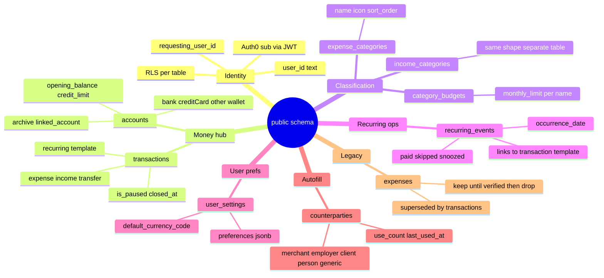
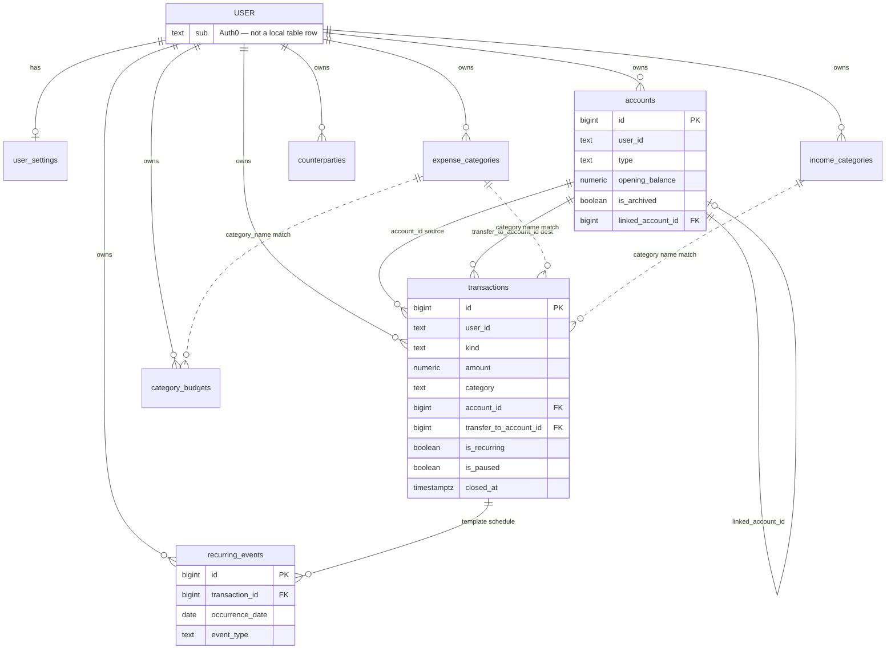

# Database Schema

Mind-map view of the Supabase Postgres schema for the Expense Tracker app. Source SQL lives in [`sql/`](../sql/). App models in [`lib/models/`](../lib/models/).

> **Auth note:** After `20260529_auth0_user_id_text.sql`, every `user_id` column is **`text`** (Auth0 JWT `sub`), not `uuid`. RLS uses `public.requesting_user_id()` → `auth.jwt() ->> 'sub'`.

---

## Hub (everything connects here)

```
                              ┌─────────────────────────┐
                              │   Auth0 JWT `sub`       │
                              │   user_id (text)        │
                              │   RLS on every table    │
                              └───────────┬─────────────┘
                                          │
        ┌─────────────┬─────────────┬─────┴─────┬─────────────┬─────────────┐
        ▼             ▼             ▼           ▼             ▼             ▼
   user_settings  categories    accounts   transactions   recurring    budgets &
   (1 row/user)   (expense +    (wallets,  (money hub)    _events      counterparties
                  income)       cards)                      (occurrence   (autofill +
                                                               actions)    limits)
```

---

## Mind map



---

## Entity relationships



Solid FK lines = enforced in Postgres. Dotted lines = logical match on `category` / `category_name` text (no FK).

---

## Table mind maps

### `transactions` — central money hub

```
transactions
├── 🔑 id                    bigint identity PK
├── 👤 user_id               text NOT NULL          → Auth0 sub
│
├── 💰 Core
│   ├── kind                 expense | income | transfer
│   ├── amount               numeric(12,2) ≥ 0
│   ├── currency_code        default 'INR'
│   ├── category             text                   → expense_categories.name OR income_categories.name
│   ├── counterparty_name    text                   merchant / payer / transfer label
│   ├── note                 text
│   └── date                 timestamptz            when it happened
│
├── 🏦 Accounts
│   ├── account_id           FK → accounts           source (expense/transfer) or deposit (income)
│   └── transfer_to_account_id FK → accounts         destination (transfer only)
│
├── 🔁 Recurring template
│   ├── is_recurring         boolean
│   ├── recurrence_frequency daily | weekly | monthly | quarterly | yearly | custom
│   ├── recurrence_start_date
│   ├── recurrence_end_date  NULL = runs forever
│   ├── reminder_timing      sameDay | oneDayBefore | twoDaysBefore | oneWeekBefore
│   ├── is_paused            boolean                temporary pause (reversible)
│   └── closed_at            timestamptz            terminal close (cancel / EMI done)
│
├── 📅 Audit
│   └── inserted_at          timestamptz
│
└── 🔗 Children
    └── recurring_events     per-occurrence paid / skipped / snoozed
```

**Dart:** `lib/models/transaction.dart` · **SQL:** `20260526_create_transactions.sql`, `20260528_recurring_events.sql`, `20260528_recurring_close.sql`

---

### `accounts` — wallets, banks, credit cards

```
accounts
├── 🔑 id                    bigint identity PK
├── 👤 user_id               text
│
├── 📛 Identity
│   ├── name                 text NOT NULL
│   ├── type                 bank | creditCard | other   (app enum)
│   ├── nickname             text                       display label
│   └── provider_name        text                       bank / issuer name
│
├── 💵 Balance & credit
│   ├── opening_balance      numeric(14,2) default 0    manual baseline
│   ├── credit_limit         numeric(14,2)              credit cards only
│   ├── statement_day        1–31
│   └── due_day              1–31
│
├── 📱 Wallet
│   └── wallet_provider      gpay | phonepe | paytm | …  when type = other
│
├── 🔗 Links & lifecycle
│   ├── linked_account_id    FK → accounts              e.g. card pays from bank
│   ├── is_archived          boolean default false
│   └── notes                text
│
├── 📅 Audit
│   └── inserted_at          timestamptz
│
└── 🔗 Referenced by
    ├── transactions.account_id
    └── transactions.transfer_to_account_id
```

**Unique:** `(user_id, lower(name), type)` · **Dart:** `lib/models/account.dart` · **SQL:** `20260517_add_named_accounts.sql`, `20260527_dashboard_data.sql`, `20260528_accounts_management.sql`

---

### `expense_categories` · `income_categories` — parallel category trees

```
expense_categories                    income_categories
├── id                                ├── id
├── user_id                           ├── user_id
├── name          (unique per user)   ├── name          (unique per user)
├── icon          Material icon key   ├── icon          Material icon key
├── sort_order    pill order          ├── sort_order
├── is_default    seeded defaults     ├── is_default    8 income seeds
└── inserted_at                       └── inserted_at
         │                                     │
         └──────────┬──────────────────────────┘
                    ▼
         transactions.category  (text match, no FK)
         category_budgets.category_name  (expense side only)
```

**Dart:** `expense_category.dart`, `income_category.dart` · **Services:** `CategoryCatalog`, `IncomeCategoryCatalog` · **SQL:** `expense_categories_table.sql`, `20260526_income_categories.sql`

---

### `category_budgets` — monthly spending limits

```
category_budgets
├── id
├── user_id
├── category_name          → matches expense_categories.name (text)
├── monthly_limit          numeric(14,2)
├── currency_code          default 'INR'
└── created_at
```

**Unique:** `(user_id, lower(category_name))` · **Dart:** `category_budget.dart` · **SQL:** `20260527_dashboard_data.sql`

---

### `recurring_events` — per-occurrence actions

```
recurring_events
├── id
├── user_id
├── transaction_id         FK → transactions (recurring template)
├── occurrence_date        date              scheduled due date acted on
├── event_type             paid | skipped | snoozed
├── snooze_until           date              only when snoozed
└── created_at
```

**Unique:** `(user_id, transaction_id, occurrence_date, event_type)` · **Dart:** `recurring_event.dart` · **SQL:** `20260528_recurring_events.sql`

```
recurring flow (conceptual)

  transactions (is_recurring=true)
       │
       ├── is_paused=true     → hidden from timeline until resumed
       ├── closed_at set      → schedule terminated, hidden everywhere
       │
       └── recurring_events
              ├── paid    → occurrence logged (+ optional one-time clone txn)
              ├── skipped → occurrence dismissed
              └── snoozed → reminder pushed to snooze_until
```

---

### `counterparties` — pinned autofill names

```
counterparties
├── id
├── user_id
├── name                     display chip label
├── kind                     merchant | employer | client | person | generic
├── use_count                ranking signal
├── last_used_at             recency ranking
└── inserted_at
```

**Unique:** `(user_id, lower(name), kind)` · **Also derived from:** `transactions.counterparty_name` GROUP BY (no FK) · **SQL:** `20260526_counterparties.sql`

| `kind` | UI context |
| --- | --- |
| `merchant` | Expense merchant field |
| `employer` | Income — Salary |
| `client` | Income — Freelance |
| `person` | Income — Gift, Cashback |
| `generic` | Other income categories |

---

### `user_settings` — one row per user

```
user_settings
├── user_id                  text PK
├── default_currency_code    default 'USD' (app often uses INR locally)
├── preferences              jsonb {}     app toggles / enums blob
└── updated_at               timestamptz
```

**Dart:** `user_settings.dart` · **Local mirror:** `SettingsPreferences` + SharedPreferences · **SQL:** `user_settings_table.sql`, `20260527_user_settings_preferences.sql`

---

### `expenses` — legacy (deprecated)

```
expenses  ⚠ legacy — app reads/writes transactions
├── id, user_id, name, category, amount, date
├── type                     oneTime | recurring
├── end_date, account_id, inserted_at
└── migrated → transactions via 20260526_create_transactions.sql
```

Safe to **drop manually** once production is verified on `transactions`. **SQL:** `expenses_table.sql`

---

## Enum & check constraints

| Table | Column | Allowed values |
| --- | --- | --- |
| `transactions` | `kind` | `expense`, `income`, `transfer` |
| `transactions` | `recurrence_frequency` | `daily`, `weekly`, `monthly`, `quarterly`, `yearly`, `custom` |
| `transactions` | `reminder_timing` | `sameDay`, `oneDayBefore`, `twoDaysBefore`, `oneWeekBefore` |
| `recurring_events` | `event_type` | `paid`, `skipped`, `snoozed` |
| `counterparties` | `kind` | `merchant`, `employer`, `client`, `person`, `generic` |
| `accounts` | `statement_day`, `due_day` | 1–31 or NULL |

Account `type` values are enforced in Dart (`AccountType`: `bank`, `creditCard`, `other`), not a Postgres CHECK.

---

## Security model

```
Every app table
├── ENABLE ROW LEVEL SECURITY
├── user_id = requesting_user_id()     ← Auth0 JWT sub
└── Policies: INSERT own … / Manage own … (ALL or split SELECT/UPDATE)

Helper function
└── public.requesting_user_id()
       RETURNS text
       SELECT auth.jwt() ->> 'sub'
```

Defined in each table migration + consolidated in `20260529_auth0_user_id_text.sql`.

---

## Migration apply order

Run in Supabase SQL editor (fresh project → existing project):

```
 1. expenses_table.sql              (legacy base — skip if greenfield)
 2. 20260517_add_named_accounts.sql
 3. 20260517_normalize_expense_accounts.sql
 4. expense_categories_table.sql
 5. user_settings_table.sql
 6. 20260526_create_transactions.sql
 7. 20260526_income_categories.sql
 8. 20260526_counterparties.sql
 9. 20260527_dashboard_data.sql
10. 20260527_user_settings_preferences.sql
11. 20260528_accounts_management.sql
12. 20260528_recurring_events.sql
13. 20260528_recurring_close.sql
14. 20260529_auth0_user_id_text.sql   ← required for Auth0 third-party auth
```

---

## App ↔ table map

| Feature | Primary tables | Service / model |
| --- | --- | --- |
| Dashboard & lists | `transactions`, `accounts`, `category_budgets` | `SupabaseService`, `dashboard_aggregations.dart` |
| Add / edit transaction | `transactions`, `accounts` | `Transaction`, `TransactionDraft` |
| Accounts & cards | `accounts` | `Account`, `account_management.dart` |
| Categories settings | `expense_categories`, `income_categories` | `CategoryCatalog`, `IncomeCategoryCatalog` |
| Budgets | `category_budgets` | `CategoryBudgetService` |
| Analytics | `transactions` (aggregated) | `analytics_aggregations.dart` |
| Recurring manager | `transactions`, `recurring_events` | `recurring_management.dart`, `upcoming_payments.dart` |
| Autofill chips | `counterparties`, `transactions` | `SourcePayerField`, `RecentSuggestionsSection` |
| App preferences | `user_settings` | `SettingsPreferences`, `CurrencySettings` |

---

## Related docs

- [ARCHITECTURE.md](./ARCHITECTURE.md) — services layer, auth flow, state
- [DESIGN.md](./DESIGN.md) — design tokens and shared UI primitives
- [supabase_setup.md](./supabase_setup.md) — project & RLS setup
- [auth0_setup.md](./auth0_setup.md) — Auth0 + Supabase integration
